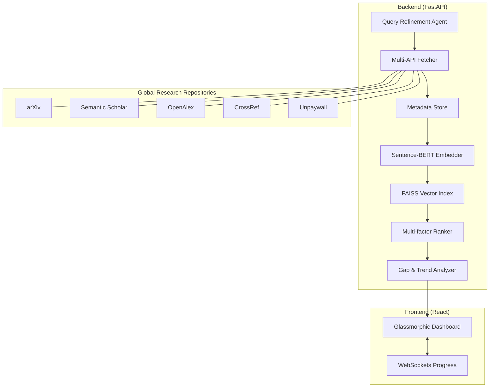

# 🧠 Research Intelligence System (RIS)

> **A state-of-the-art Neural Research Discovery Engine** that transforms natural language queries into a multi-dimensional matrix of academic insights using Semantic RAG and Global Research APIs.

[](https://python.org)
[](https://reactjs.org)
[](https://fastapi.tiangolo.com)
[](https://github.com/facebookresearch/faiss)
[](https://research-intelligence-engine-72d8clj0c.vercel.app/)
[](LICENSE)

---

## 📌 Overview

**Research Intelligence System (RIS)** is a professional-grade discovery platform designed to bypass the limitations of traditional keyword-based academic search. By combining **Retrieval-Augmented Generation (RAG)** with a unified multi-API pipeline, RIS allows researchers to explore the global knowledge matrix with semantic precision.

Simply enter a messy research idea, and the system will refine it, fetch relevant metadata from 5+ global repositories, encode abstracts into a high-dimensional vector space, and synthesize intelligence on research gaps and trajectory trends.

---

## ✨ Features

| Feature | Description |
|:---|:---|
| 🔍 **Neural Discovery** | Semantic search via `all-MiniLM-L6-v2` embeddings — finds what you *mean*, not just what you *type*. |
| 🤖 **AI Query Agent** | Rule-based and LLM-ready query refinement to transform natural language into academic syntax. |
| 🌐 **Unified Matrix** | Parallel ingestion from **arXiv**, **Semantic Scholar**, **OpenAlex**, **CrossRef**, and **Unpaywall**. |
| 📊 **Trend Synthesis** | Real-time trajectory analysis and gap detection to identify untapped research opportunities. |
| 🌗 **Premium UI** | Glassmorphic dashboard with a dynamic theme engine (Light/Dark mode) and fluid micro-animations. |
| ⚡ **Live Processing** | WebSocket-driven progress tracking for the entire 6-step neural pipeline. |
| 🔖 **Knowledge Library** | Local persistence for saved papers, enabling a curated personal research archive. |
| 🛡️ **Matrix Filters** | Advanced faceted search for access types (Open Access, Preprint, etc.), citations, and year ranges. |

---

## 🏗️ Architecture



**Neural Pipeline Workflow:**

1. **Refining**: User query is refined into precise academic entities.
2. **Aggregation**: Parallel fetching from global metadata repositories.
3. **Encoding**: Abstracts are transformed into 384-dimensional dense vectors.
4. **Discovery**: Nearest-neighbor search in the local vector space via FAISS.
5. **Intelligence**: Multi-factor ranking (Relevance + Citations + Recency).
6. **Synthesis**: Synthesis of gaps, trends, and trajectory analysis.

---

## 📁 Project Structure

```text
RESEARCH_INTELLIGENCE/
├── backend/                # 🐍 FastAPI Backend
│   ├── main.py             # Server Entry Point & WebSocket Handler
│   ├── agents/             # AI Query Refinement Logic
│   ├── api/                # API Connectors (arXiv, OpenAlex, etc.)
│   ├── core/               # ML Core (Embedder, FAISS, Ranker, Analyzer)
│   ├── data/               # In-memory & Persistent Storage
│   └── requirements.txt    # Python Dependencies
│
├── frontend/               # ⚛️ React Frontend
│   ├── src/
│   │   ├── App.js          # Main Dashboard & Neural Pipeline Logic
│   │   ├── App.css         # Premium Glassmorphic Theme System
│   │   └── index.js        # React Entry Point
│   └── package.json        # Frontend Dependencies
│
├── setup_windows.bat       # 🪟 One-click Windows Setup
├── setup_mac_linux.sh      # 🍎 One-click Unix Setup
└── README.md               # 📖 Professional Documentation
```

---

## 🚀 Quick Start

### 1. Prerequisites

- Python **3.10+**
- Node.js **18.x+**
- [Git](https://git-scm.com/)

### 2. Installation (Windows Recommended)

We provide a unified setup script to automate environment creation and dependency installation:

```powershell
# Run the automated setup
./setup_windows.bat
```

### 3. Running the System

**Terminal 1: Backend**

```bash
cd backend
venv\Scripts\activate
uvicorn main:app --reload --port 8000
```

**Terminal 2: Frontend**

```bash
cd frontend
npm start
```

**Dashboard Access:** Open [http://localhost:3000](http://localhost:3000)

**Live Demo:** [https://research-intelligence-engine-72d8clj0c.vercel.app/](https://research-intelligence-engine-72d8clj0c.vercel.app/)

---

## 🛠️ Tech Stack

- **ML Core**: `sentence-transformers` (all-MiniLM-L6-v2), `faiss-cpu`.
- **Backend API**: FastAPI (Asynchronous), Pydantic, WebSockets.
- **Frontend**: React 18, Vanilla CSS (Glassmorphism), `react-scripts`.
- **Data Ingestion**: Multi-threaded API fetching with rate-limit handling.

---

## 🔬 How It Works — Neural Discovery

1. **Vectorization**: RIS converts every paper abstract into a dense mathematical vector. Unlike keyword search, this captures the **contextual meaning** of the research.
2. **Vector Search**: Using FAISS (Facebook AI Similarity Search), the system can scan through thousands of encoded papers in milliseconds to find conceptual matches.
3. **Synthesis Layer**: The analyzer scans the publication dates and citation counts of the retrieved set to calculate "Research Velocity" and "Interest Gaps."

---

## 🔐 Compliance & Privacy

- **Metadata Only**: RIS processes only publicly available metadata and abstracts. No full-text PDFs are stored, ensuring 100% copyright compliance.
- **Official Channels**: All research data is pulled through authorized public API endpoints.
- **Local Context**: Your research library and query history are stored locally within your instance.

---

## 📦 Core Dependencies

```text
fastapi                 # Backend Framework
uvicorn[standard]       # ASGI Server
sentence-transformers   # Neural Embeddings
faiss-cpu               # Vector Database
pydantic                # Data Validation
requests                # API Communication
react                   # Frontend Library
```

---

## 🤝 Contributing

We welcome contributions to the Research Intelligence System!

1. Fork the Project
2. Create your Feature Branch (`git checkout -b feature/AmazingFeature`)
3. Commit your Changes (`git commit -m 'Add some AmazingFeature'`)
4. Push to the Branch (`git push origin feature/AmazingFeature`)
5. Open a Pull Request

---

## 📄 License

Distributed under the **MIT License**. See `LICENSE` for more information.

---

## 👨‍💻 Author

**K. Rohith Reddy**
[GitHub](https://github.com/Rohithstu) · [LinkedIn](https://linkedin.com/in/rohithreddy)

---

<div align="center">
  <sub>Built with ❤️ using Python, FAISS, Sentence Transformers, and React</sub>
</div>